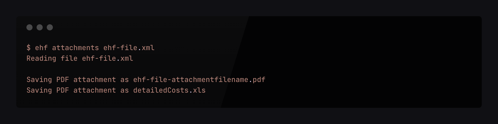

<h2 align="center">EHF CLI - The CLI tool for EHF files</h2>
<p align="center">
  <br>
  
  <br><br>
  <i>Node based CLI tool for doing stuff with EHF and PEPPOL XML files</i>
  <br>
</p>

## Prerequisites
Install Node.js which includes Node Package Manager

## Getting started
Install the EHF CLI globally:
```sh
npm install -g ehf-cli
```

## Commands
| Command | Description |
| ------- | ----------- |
| attachments | Save embedded attachments to disk |

## Examples
### Extract embedded attachments to disk
```sh
$ ehf attachments ehf-file.xml
Reading file ehf-file.xml

Saving PDF attachment as ehf-file-attachmentfilename.pdf
Saving PDF attachment as detailedCosts.xls
```